# duSOCPortal Backend - Low-Level Design (LLD) Diagram

## System Architecture Overview

```mermaid
graph TB
    subgraph "Client Layer"
        WEB["Web Client"]
        MOBILE["Mobile Client"]
    end

    subgraph "API Gateway Layer"
        GATEWAY["Django REST Framework<br/>API Gateway"]
    end

    subgraph "Authentication & Authorization Layer"
        AUTH["Authentication Module<br/>(auth/views.py)"]
        JWT["JWT Token Handler<br/>(rest_framework_simplejwt)"]
        LDAP["LDAP Service<br/>(common/utils.py)"]
        RBAC["Role-Based Access Control<br/>(authentication/permissions.py)"]
    end

    subgraph "Application Logic Layer"
        subgraph "Tenant Management"
            TENANT_VIEW["Tenant Views<br/>(tenant/views.py)"]
            TENANT_ADMIN["Tenant Admin<br/>(tenantadmin/views.py)"]
        end

        subgraph "Integration Management"
            INT_VIEW["Integration Views<br/>(integration/views.py)"]
            INT_SERVICE["Integration Service<br/>(integration_modules)"]
        end

        subgraph "Data Processing"
            SIEM_PROCESSOR["SIEM Data Processor<br/>(IBMQRadar)"]
            SOAR_PROCESSOR["SOAR Data Processor<br/>(CortexSOAR)"]
            ITSM_PROCESSOR["ITSM Data Processor<br/>(ManageEngine)"]
            THREAT_INTEL["Threat Intelligence<br/>(Cyware)"]
        end
    end

    subgraph "External Integration Modules"
        QRADAR["IBM QRadar<br/>API Client<br/>(common/modules/ibm_qradar.py)"]
        QRADAR_TOKEN["QRadar Token Auth<br/>(ibm_qradar_token.py)"]
        CORTEX["Cortex SOAR<br/>API Client<br/>(cortex_soar.py)"]
        ITSM["ManageEngine ITSM<br/>API Client<br/>(itsm.py)"]
        CYWARE["Cyware Threat Intel<br/>API Client<br/>(cyware.py)"]
    end

    subgraph "Database Layer - Models"
        subgraph "User & Auth Models"
            USER_MODEL["User Model"]
            ROLE_MODEL["Role & RolePermission"]
            RBAC_MODEL["RolePermission Model"]
        end

        subgraph "Integration Models"
            INT_MODEL["Integration Model<br/>(type, subtype, status)"]
            CRED_MODEL["IntegrationCredentials<br/>(api_key, username_password)"]
        end

        subgraph "SIEM Data Models"
            QRADAR_TENANT["DuIbmQradarTenants<br/>(domain/tenant)"]
            QR_ASSETS["IBMQradarAssests<br/>(asset inventory)"]
            QR_EVENTS["IBMQradarEventCollector<br/>(log sources)"]
            QR_OFFENSE["IBMQradarOffense<br/>(security offenses)"]
            QR_LOGS["EventCountLog, DailyEventLog<br/>CorrelatedEventLog, etc"]
        end

        subgraph "SOAR Data Models"
            SOAR_TENANT["DuCortexSOARTenants"]
            SOAR_INCIDENT["DUCortexSOARIncidentFinalModel"]
            SOAR_NOTES["DUSoarNotes"]
        end

        subgraph "ITSM Data Models"
            ITSM_TENANT["DuITSMTenants"]
            ITSM_TICKET["DuITSMFinalTickets"]
        end

        subgraph "Threat Intelligence Models"
            TI_TENANT["ThreatIntelligenceTenant"]
            TI_ALERT["ThreatIntelligenceTenantAlerts"]
            TI_ALERT_DETAIL["CywareTenantAlertDetails"]
            TI_TAG["CywareTenantTag"]
            TI_GROUP["CywareTenantGroup"]
        end

        subgraph "Company & Tenant Models"
            COMPANY["Company Model<br/>(multi-tenant)"]
            TENANT_MODEL["Tenant Model<br/>(user to company mapping)"]
            CHAT["ChatMessage<br/>(support messaging)"]
        end

        subgraph "SLA & Metrics Models"
            DEFAULT_SLA["DefaultSoarSlaMetric<br/>(P1-P4 levels)"]
            TENANT_SLA["SoarTenantSlaMetric<br/>(custom SLA per tenant)"]
            EPS_METRIC["IBMQradarEPS<br/>IBMQradarDailyEPS"]
        end
    end

    subgraph "Database"
        POSTGRES["PostgreSQL Database<br/>(django ORM)"]
    end

    subgraph "External Services"
        AD["Active Directory<br/>(LDAP)"]
        QRADAR_SVC["IBM QRadar<br/>Service"]
        SOAR_SVC["Cortex SOAR<br/>Service"]
        ITSM_SVC["ManageEngine ITSM<br/>Service"]
        CYWARE_SVC["Cyware Threat<br/>Intelligence Service"]
    end

    subgraph "Utilities & Common"
        UTILS["Utils Module<br/>(password hashing, LDAP)"]
        CONST["Constants<br/>(RBAC, LDAP, Encryption)"]
    end

    subgraph "API Documentation"
        SWAGGER["Swagger/OpenAPI<br/>(drf-yasg)"]
        REDOC["ReDoc<br/>(API Docs)"]
    end

    %% Client to Gateway
    WEB --> GATEWAY
    MOBILE --> GATEWAY

    %% Gateway to Auth
    GATEWAY --> AUTH
    GATEWAY --> RBAC

    %% Auth flow
    AUTH --> JWT
    AUTH --> LDAP
    LDAP --> AD
    AUTH --> UTILS

    %% Application layer connections
    GATEWAY --> TENANT_VIEW
    GATEWAY --> TENANT_ADMIN
    GATEWAY --> INT_VIEW

    %% Integration connections
    INT_VIEW --> INT_SERVICE
    INT_SERVICE --> QRADAR
    INT_SERVICE --> QRADAR_TOKEN
    INT_SERVICE --> CORTEX
    INT_SERVICE --> ITSM
    INT_SERVICE --> CYWARE

    %% Data processing
    INT_VIEW --> SIEM_PROCESSOR
    INT_VIEW --> SOAR_PROCESSOR
    INT_VIEW --> ITSM_PROCESSOR
    INT_VIEW --> THREAT_INTEL

    %% External API connections
    QRADAR --> QRADAR_SVC
    QRADAR_TOKEN --> QRADAR_SVC
    CORTEX --> SOAR_SVC
    ITSM --> ITSM_SVC
    CYWARE --> CYWARE_SVC

    %% Database connections
    AUTH --> USER_MODEL
    TENANT_VIEW --> TENANT_MODEL
    TENANT_VIEW --> COMPANY
    TENANT_ADMIN --> ROLE_MODEL
    INT_VIEW --> INT_MODEL
    INT_VIEW --> CRED_MODEL

    SIEM_PROCESSOR --> QRADAR_TENANT
    SIEM_PROCESSOR --> QR_ASSETS
    SIEM_PROCESSOR --> QR_EVENTS
    SIEM_PROCESSOR --> QR_OFFENSE
    SIEM_PROCESSOR --> QR_LOGS

    SOAR_PROCESSOR --> SOAR_TENANT
    SOAR_PROCESSOR --> SOAR_INCIDENT
    SOAR_PROCESSOR --> SOAR_NOTES

    ITSM_PROCESSOR --> ITSM_TENANT
    ITSM_PROCESSOR --> ITSM_TICKET

    THREAT_INTEL --> TI_TENANT
    THREAT_INTEL --> TI_ALERT
    THREAT_INTEL --> TI_ALERT_DETAIL
    THREAT_INTEL --> TI_TAG
    THREAT_INTEL --> TI_GROUP

    TENANT_VIEW --> DEFAULT_SLA
    TENANT_VIEW --> TENANT_SLA
    TENANT_VIEW --> EPS_METRIC
    TENANT_VIEW --> CHAT

    %% All models to database
    USER_MODEL --> POSTGRES
    ROLE_MODEL --> POSTGRES
    RBAC_MODEL --> POSTGRES
    INT_MODEL --> POSTGRES
    CRED_MODEL --> POSTGRES
    QRADAR_TENANT --> POSTGRES
    QR_ASSETS --> POSTGRES
    QR_EVENTS --> POSTGRES
    QR_OFFENSE --> POSTGRES
    QR_LOGS --> POSTGRES
    SOAR_TENANT --> POSTGRES
    SOAR_INCIDENT --> POSTGRES
    SOAR_NOTES --> POSTGRES
    ITSM_TENANT --> POSTGRES
    ITSM_TICKET --> POSTGRES
    TI_TENANT --> POSTGRES
    TI_ALERT --> POSTGRES
    TI_ALERT_DETAIL --> POSTGRES
    TI_TAG --> POSTGRES
    TI_GROUP --> POSTGRES
    COMPANY --> POSTGRES
    TENANT_MODEL --> POSTGRES
    CHAT --> POSTGRES
    DEFAULT_SLA --> POSTGRES
    TENANT_SLA --> POSTGRES
    EPS_METRIC --> POSTGRES

    %% Utils connections
    INT_SERVICE --> UTILS
    INT_SERVICE --> CONST
    AUTH --> CONST

    %% Documentation
    GATEWAY --> SWAGGER
    GATEWAY --> REDOC

    %% Styling
    classDef clientLayer fill:#e1f5ff
    classDef gatewayLayer fill:#fff3e0
    classDef authLayer fill:#f3e5f5
    classDef appLayer fill:#e8f5e9
    classDef dbModelLayer fill:#fce4ec
    classDef dbLayer fill:#eceff1
    classDef externalLayer fill:#fff9c4
    classDef utilLayer fill:#f1f8e9

    class WEB,MOBILE clientLayer
    class GATEWAY gatewayLayer
    class AUTH,JWT,LDAP,RBAC authLayer
    class TENANT_VIEW,TENANT_ADMIN,INT_VIEW,INT_SERVICE appLayer
    class SIEM_PROCESSOR,SOAR_PROCESSOR,ITSM_PROCESSOR,THREAT_INTEL appLayer
    class USER_MODEL,ROLE_MODEL,RBAC_MODEL,INT_MODEL,CRED_MODEL dbModelLayer
    class QRADAR_TENANT,QR_ASSETS,QR_EVENTS,QR_OFFENSE,QR_LOGS dbModelLayer
    class SOAR_TENANT,SOAR_INCIDENT,SOAR_NOTES dbModelLayer
    class ITSM_TENANT,ITSM_TICKET dbModelLayer
    class TI_TENANT,TI_ALERT,TI_ALERT_DETAIL,TI_TAG,TI_GROUP dbModelLayer
    class COMPANY,TENANT_MODEL,CHAT dbModelLayer
    class DEFAULT_SLA,TENANT_SLA,EPS_METRIC dbModelLayer
    class POSTGRES dbLayer
    class QRADAR,QRADAR_TOKEN,CORTEX,ITSM,CYWARE externalLayer
    class AD,QRADAR_SVC,SOAR_SVC,ITSM_SVC,CYWARE_SVC externalLayer
    class UTILS,CONST utilLayer
```



## Component Details

### 1. Client Layer

- **Web Client**: Frontend application
- **Mobile Client**: Mobile application

### 2. API Gateway Layer

- **Django REST Framework**: Central API gateway using DRF
- Handles all incoming HTTP requests and routes them to appropriate views

### 3. Authentication & Authorization Layer

#### Components:

- **Authentication Module** (`auth/views.py`)

  - User login and registration
  - JWT token generation and management
  - LDAP authentication against Active Directory

- **JWT Token Handler** (`rest_framework_simplejwt`)

  - Access token generation (short-lived)
  - Refresh token handling
  - Token validation for protected endpoints

- **LDAP Service** (`common/utils.py`)

  - Connects to CUSTOMER_AD LDAP server
  - User authentication validation
  - Support for both username and email-based login

- **RBAC** (`authentication/permissions.py`)

  - Permission classes:
    - `IsAdminUser`: Super admin access
    - `IsTenant`: Tenant-level access
    - `IsReadonlyAdminUser`: Read-only admin access

### 4. Application Logic Layer

#### Tenant Management Subsystem

- **TenantAPIView**: Retrieves tenant information and role details
- **TenantAdminView**: Admin operations for tenant management
- Models: `Tenant`, `Company`, `TenantRole`, `TenantRolePermissions`, `ChatMessage`

#### Integration Management Subsystem

- **IntegrationTypesView**: Lists available integration types and subtypes
- **IntegrationView**: CRUD operations for integrations
- **CredentialManagement**: Secure storage and management of integration credentials
- Models: `Integration`, `IntegrationCredentials`, `IntegrationTypes` (enum)

#### Data Processing Subsystems

1. **SIEM Processor** (IBM QRadar)

   - Fetches tenants, assets, event collectors, offenses
   - Processes event logs, EPS metrics, security data
   - Models: `DuIbmQradarTenants`, `IBMQradarAssests`, `IBMQradarOffense`, event logs

1. **SOAR Processor** (Cortex SOAR)

   - Manages incidents, playbooks, automation
   - Tracks incident lifecycle, notes, and SLA metrics
   - Models: `DuCortexSOARTenants`, `DUCortexSOARIncidentFinalModel`, `DUSoarNotes`

1. **ITSM Processor** (ManageEngine)

   - Creates and syncs tickets
   - Manages incident-to-ticket mapping
   - Models: `DuITSMTenants`, `DuITSMFinalTickets`

1. **Threat Intelligence Processor** (Cyware)

   - Fetches threat alerts and advisories
   - Manages tags, groups, categories
   - Models: `ThreatIntelligenceTenant`, `ThreatIntelligenceTenantAlerts`, custom fields

### 5. External Integration Modules

Located in `common/modules/`:

- **IBMQradar** (`ibm_qradar.py`)

  - API client for IBM QRadar SIEM
  - Methods: get_tenants(), get_assets(), get_offenses(), get_events()
  - Supports username/password authentication

- **IBMQradarToken** (`ibm_qradar_token.py`)

  - Token-based authentication for QRadar
  - Alternative to username/password auth

- **CortexSOAR** (`cortex_soar.py`)

  - API client for Palo Alto Networks Cortex SOAR
  - Methods: get_accounts(), create_incident(), update_incident()
  - Uses API token authentication

- **ITSM** (`itsm.py`)

  - API client for ManageEngine ServiceDesk Plus
  - Methods: get_accounts(), create_ticket(), update_ticket()
  - Uses token-based authentication

- **Cyware** (`cyware.py`)

  - API client for Cyware Threat Intelligence Platform
  - Methods: get_alert_list(), get_alert_details(), get_groups(), get_tags()
  - Uses Secret Key and Access Key authentication

### 6. Database Layer - Data Models

#### User & Authentication Models

```
User (AbstractBaseUser)
├── id, username (unique), email (unique)
├── hashed_password, is_admin, is_tenant, is_active, is_deleted
├── is_read_only, created_at, updated_at
└── Related: Role, UserRole, RolePermission

Role
├── id, name, role_type (SUPER_ADMIN, ADMIN, USER)
└── Related: RolePermission

RolePermission
├── role (FK), permission (enum), permission_text
└── Permissions: DASHBOARD, REPORTS, THREAT_INTELLIGENCE, ASSETS

UserRole
├── user (FK), role (FK)
```

#### Integration Models

```
Integration
├── id, integration_type (enum)
├── siem_subtype, soar_subtype, itsm_subtype, threat_intelligence_subtype
├── instance_name, status, created_by (FK), modified_by (FK)
└── created_at, updated_at

IntegrationCredentials
├── integration (FK)
├── credential_type (API_KEY, USERNAME_PASSWORD, SECRET_KEY_ACCESS_KEY)
├── username, password, api_key, base_url
├── access_key, secret_key, ip_address, port
└── created_at, updated_at
```

#### SIEM Data Models (IBM QRadar)

```
DuIbmQradarTenants
├── id, db_id (QRadar domain ID), name
└── integration (FK)

IBMQradarEventCollector
├── id, db_id, name, host_id, component_name
└── integration (FK)

IBMQradarLogSourceTypes
├── id, db_id, name, version
└── integration (FK)

IBMQradarAssests
├── id, db_id, name, description, sending_ip, enabled, status
├── event_collector (FK), log_source_type (FK)
├── group_ids (ArrayField), average_eps, creation_date_converted
└── integration (FK), created_at, updated_at

IBMQradarAssetsGroup
├── id, db_id, name, description, owner, parent_id
├── child_group_ids (ArrayField), assignable
└── integration (FK)

IBMQradarOffense
├── id, db_id (unique), qradar_tenant_domain (FK)
├── description, event_count, flow_count, assigned_to
├── severity, magnitude, credibility, relevance
├── status, start_time, last_updated_time, close_time
├── source_address_ids, destination_networks, categories, rules (JSONField)
└── Multiple date fields for analysis

Event Log Models (Time Series Data):
- EventCountLog
- DailyEventLog
- CorrelatedEventLog
- WeeklyCorrelatedEventLog
- SuspiciousEventLog
- DosEventLog
- TopDosEventLog
- TopAlertEventLog
- DailyClosureReasonLog
- IBMQradarEPS / IBMQradarDailyEPS
- WeeklyAvgEpsLog
- MonthlyAvgEpsLog
- LastMonthAvgEpsLog
- TotalTrafficLog
- DestinationAddressLog
- TopDestinationConnectionLog
- SuccessfulLogonEvent
- RemoteUsersCount
- TotalEvents
- DailyEventCountLog
```

#### SOAR Data Models (Cortex SOAR)

```
DuCortexSOARTenants
├── id, db_id, name
└── integration (FK)

DUCortexSOARIncidentFinalModel
├── id, db_id, created, modified, account, name, status
├── reason, occurred, closed, sla, severity, owner
├── playbook_id, investigated_id, closing_user_id
├── Custom Fields: incident_phase, incident_priority, tta, ttdn, ttn
├── JSON Fields: list_of_rules_offense, log_source_type, source_ips
├── Metrics: tta_calculation, mitre_tactic, mitre_technique
├── cortex_soar_tenant (FK), integration (FK)
└── created_at, updated_at

DUSoarNotes
├── id, db_id (unique), category, content, created, user, account
├── incident (FK), integration (FK)
└── created_at, updated_at
```

#### ITSM Data Models (ManageEngine)

```
DuITSMTenants
├── id, db_id (unique), name
└── integration (FK)

DuITSMFinalTickets
├── id, db_id (unique), short_description, subject, is_overdue
├── creation_date, created_by_name, account_name
├── soar_id (reference to SOAR incident), status
├── itsm_tenant (FK), integration (FK)
└── created_at, updated_at
```

#### Threat Intelligence Models (Cyware)

```
ThreatIntelligenceTenant
├── id, threat_intelligence (enum: CYWARE)
├── access_key, secret_key, base_url
├── company (OneToOne FK)
└── created_at, updated_at

ThreatIntelligenceTenantAlerts
├── id, db_id (unique), title, status, published_time
├── threat_intelligence (FK)
└── created_at, updated_at

CywareTenantAlertDetails
├── id, short_id (unique), title, content, status, tlp
├── published_time, push_required, push_email_notification
├── tracking_id, card_image, card_info, event, intel_id, rfi_id
├── alert (FK), threat_intelligence (FK)
├── card_groups (M2M), recipient_groups (M2M)
├── card_tag (M2M), card_category (FK)
└── created_at, updated_at

CywareTenantTag
├── id, db_id (UUID, unique), tag_name, tag_slug (unique)
├── is_active, threat_intelligence (FK)
└── created_at, updated_at

CywareTenantGroup
├── id, db_id (unique), group_name, group_tlp, group_type
├── allowed_for_intel_submission, allowed_for_rfi_submission
├── threat_intelligence (FK)
└── created_at, updated_at

CywareTenantCustomField
├── id, db_id (unique), field_name, field_label, field_type
├── field_description, is_system
├── threat_intelligence (FK)
└── created_at, updated_at

CywareTenantCategories
├── id, db_id (unique), category_name
├── threat_intelligence (FK)
├── threat_indicator_fields (M2M to CywareTenantCustomField)
├── additional_fields (M2M)
├── required_fields (M2M)
└── created_at, updated_at
```

#### Company & Multi-Tenancy Models

```
Company
├── id, company_name (unique), phone_number, industry, country
├── profile_picture, is_default_sla, is_defualt_threat_intel
├── created_by (FK), created_at, updated_at
├── Many-to-Many: qradar_tenants, event_collectors
├── Many-to-Many: integrations, itsm_tenants, soar_tenants

Tenant (User-to-Company mapping)
├── id, company (FK), tenant (FK to User)
├── created_by (FK), ldap_group, country
└── created_at, updated_at

TenantRole
├── id, tenant (FK), name, role_type (TENANT_ADMIN, TENANT_USER)
└── related: role_permissions

TenantRolePermissions
├── role (FK), permission (enum), permission_text
└── Permissions: DASHBOARD, REPORTS, THREAT_INTELLIGENCE, ASSETS

ChatMessage
├── id, sender (FK to User), admin (FK to User)
├── tenant (FK), message, is_admin_seen, is_admin_seen_at
├── is_tenant_seen, is_tenant_seen_at, timestamp

TenantQradarMapping
├── id, company (FK), qradar_tenant (FK)
├── event_collectors (M2M)
├── contracted_volume_type (EPS, GB/DAY)
├── contracted_volume (amount)
└── unique_together: company, qradar_tenant

ThreatIntelligenceTenant
├── id, company (OneToOne FK)
├── threat_intelligence (enum), access_key, secret_key, base_url
└── unique_together: access_key, secret_key, base_url
```

#### SLA & Metrics Models

```
DefaultSoarSlaMetric
├── sla_level (P1, P2, P3, P4 - unique)
├── tta_minutes, ttn_minutes, ttdn_minutes
└── created_at, updated_at

SoarTenantSlaMetric
├── company (FK), soar_tenant (FK), sla_level
├── tta_minutes, ttn_minutes, ttdn_minutes
└── unique_together: company, soar_tenant, sla_level

IBMQradarEPS
├── domain (FK), integration (FK)
├── average_eps, peak_eps, qradar_end_time
└── created_at, updated_at

IBMQradarDailyEPS
├── domain (FK), integration (FK)
├── average_eps, peak_eps, qradar_end_time
└── created_at, updated_at
```

### 7. Database (PostgreSQL)

- Uses Django ORM
- Supports ArrayField for SIEM asset groups
- Supports JSONField for complex incident data
- Includes indexes on frequently queried fields (username, source_ip, date fields)

### 8. External Services

#### Active Directory (LDAP)

- **Purpose**: User authentication
- **Server**: Configured in `LDAPConstants.CUSTOMER_LDAP_SERVERS`
- **Bind Domain**: `CUSTOMER_BIND_DOMAIN`

#### IBM QRadar SIEM

- **Purpose**: Security event collection and analysis
- **Authentication**: Username/password or API token
- **Base URL**: Configured per integration
- **Operations**: Fetch domains, assets, offenses, events

#### Cortex SOAR

- **Purpose**: Security orchestration and automated response
- **Authentication**: API token
- **Operations**: Create/update incidents, manage playbooks

#### ManageEngine ITSM

- **Purpose**: Ticketing and IT service management
- **Authentication**: API token
- **Operations**: Create/update tickets, manage accounts

#### Cyware Threat Intelligence

- **Purpose**: Threat intelligence and advisory services
- **Authentication**: Secret key + Access key
- **Operations**: Fetch alerts, manage tags/groups/categories

## Data Flow Examples

### 1. User Authentication Flow

```
1. Client sends credentials (username/password) to /auth/login/
2. AuthView receives request
3. LDAP service validates against CUSTOMER_AD
4. On success: User model retrieved/created
5. JWT tokens (access + refresh) generated
6. Tokens returned to client
```

### 2. Integration Setup Flow

```
1. Admin creates Integration instance with:
   - integration_type (SIEM/SOAR/ITSM/Threat Intel)
   - subtype (QRadar/SOAR/ManageEngine/Cyware)
   - instance_name

2. Admin configures IntegrationCredentials:
   - credential_type (API_KEY/USERNAME_PASSWORD/SECRET_KEY_ACCESS_KEY)
   - Credentials stored (encrypted in production)

3. Connection test performed using respective API client
   (IBMQradar/CortexSOAR/ITSM/Cyware)

4. On success: Integration marked as active
```

### 3. Data Synchronization Flow (QRadar Example)

```
1. Background task triggers (Celery, based on timestamps)
2. IBMQradar API client queries with credentials
3. Data retrieved: tenants, assets, offenses, event logs
4. Models created/updated in database:
   - DuIbmQradarTenants
   - IBMQradarAssests
   - IBMQradarOffense
   - EventCountLog, DailyEventLog, etc.
5. Data aggregated for dashboard display
```

### 4. Incident Enrichment Flow

```
1. QRadar offense detected
2. SOAR platform processes incident
3. ITSM ticket created via ManageEngine
4. Incident enriched with:
   - Threat intelligence from Cyware
   - MITRE ATT&CK mapping
   - SLA metrics applied
5. Incident stored in DUCortexSOARIncidentFinalModel
6. Cross-references created between:
   - Offense → Incident → Ticket
```

## API Endpoints Summary

### Authentication

- `POST /auth/login/` - User login
- `POST /auth/token/refresh/` - Refresh JWT token
- `POST /auth/create-user/` - Create new user (admin only)

### Tenant Management

- `GET /tenant/` - Get tenant info and roles
- `GET /tenant/permission-choices/` - Get available permissions
- `GET /tenant/qradar-tenants/` - List QRadar tenants
- `GET /tenant/soar-incidents/` - List SOAR incidents
- `GET /tenant/itsm-tickets/` - List ITSM tickets
- `GET /tenant/threat-alerts/` - List threat intelligence alerts
- `GET /tenant/dashboard/` - Get dashboard metrics

### Integration Management

- `GET /integration/types/` - List integration types
- `POST /integration/` - Create integration
- `GET /integration/` - List integrations
- `PUT /integration/{id}/` - Update integration
- `DELETE /integration/{id}/` - Delete integration
- `POST /integration/test-connection/` - Test integration credentials

### Admin Functions

- `GET /admin/users/` - List users
- `POST /admin/users/` - Create user
- `PUT /admin/users/{id}/` - Update user
- `DELETE /admin/users/{id}/` - Delete user
- `GET /admin/companies/` - List companies
- `POST /admin/companies/` - Create company

### Documentation

- `GET /docs/` - Swagger UI
- `GET /redoc/` - ReDoc documentation
- `GET /swagger.json` - OpenAPI specification (JSON)
- `GET /swagger.yaml` - OpenAPI specification (YAML)

## Key Design Patterns

1. **Multi-Tenancy**: Company model with many-to-many relationships to resources
1. **RBAC**: Role-based permission system at both admin and tenant levels
1. **API Client Pattern**: External services abstracted through dedicated client classes
1. **Model Inheritance**: User extends AbstractBaseUser for custom authentication
1. **Async Processing**: Celery tasks for data synchronization
1. **JWT Authentication**: Stateless authentication using refresh/access tokens
1. **DTO Pattern**: Serializers for request/response validation and transformation
1. **Repository Pattern**: Django ORM acts as data access layer

## Security Considerations

1. **LDAP Authentication**: User validation against corporate Active Directory
1. **Password Hashing**: Custom password hashing via PasswordCreation utility
1. **API Token Security**: Credentials stored encrypted (noted as TODO in code)
1. **JWT Tokens**: Time-limited access tokens with refresh mechanism
1. **Read-Only Users**: Designated read-only admin role for monitoring
1. **Soft Deletes**: Users marked as deleted rather than permanently removed
1. **Audit Fields**: created_by, modified_by tracking for integrations

## Performance Optimizations

1. **Database Indexes**: On username, source_ip, date fields
1. **Query Optimization**: prefetch_related, select_related for foreign keys
1. **Time Series Data**: Separate log tables for event analytics
1. **Pagination**: PageNumberPagination for large result sets
1. **Caching**: DateTimeStorage model for tracking last sync times
1. **Bulk Operations**: Batch data import from external systems

## Technology Stack

- **Framework**: Django 5.2
- **REST API**: Django REST Framework
- **ORM**: Django ORM with PostgreSQL
- **Authentication**: JWT (rest_framework_simplejwt), LDAP
- **API Clients**: Custom HTTP clients using requests library
- **Documentation**: Swagger/OpenAPI (drf-yasg), ReDoc
- **Task Queue**: Celery (for async data sync)
- **Logging**: Loguru
- **Encryption**: Cryptography library

______________________________________________________________________

*This LLD diagram represents the system architecture as of the latest codebase analysis.*
